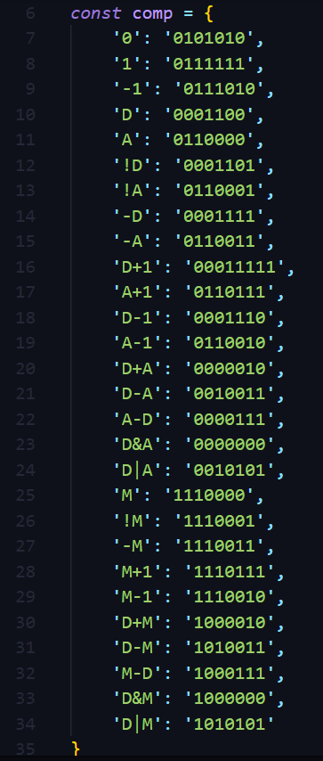
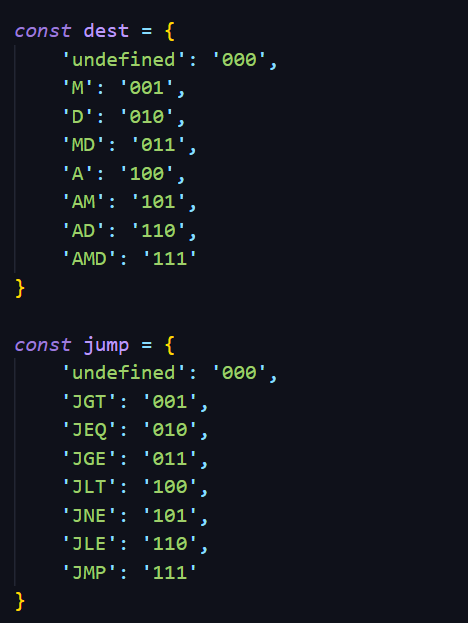
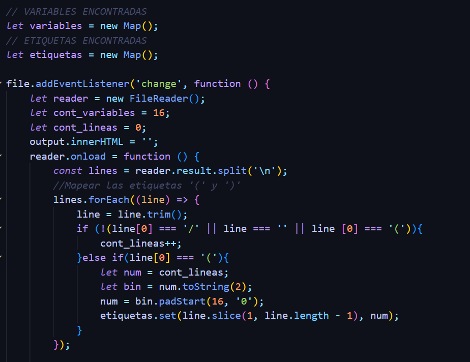
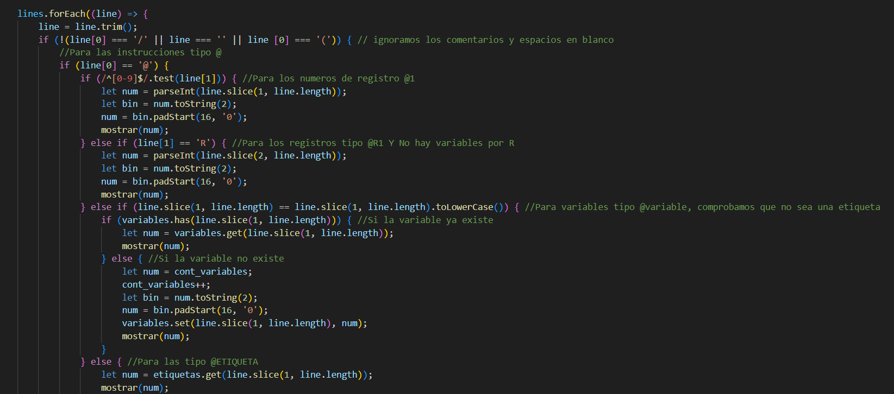
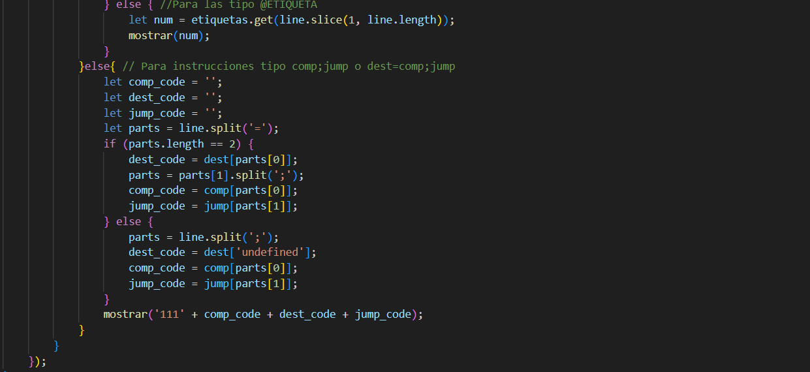

# PROYECTO 6
En esta práctica 4 se realiza el proyecto 6 de Nand2Tetris.

## Assembler
El objetivo de este proyecto es crear un programa capaz de traducir programas escritos en un lenguaje de bajo nivel a código binario (Es decir, que reciba archivos `asm` y devuelva un archivo `hack` con el código binario) que pueda ejecutarse en el ensamblador de Nand2Tetris, posteriormente se prueba dicho programa con unos los archivos de prueba `Add.asm`, `Max.asm`, `Rect.asm` y `Pong.asm`.

## Implementación en Js
El programa se hizo con el lenguaje de programación JavaScript. 

El primer paso fue predefinir ciertas tablas en formas de diccionario para los comandos de bajo nivel a código binario. 

Se crea un mapa tanto para las variables como para las etiquetas que se encuentren.

Se usa también la siguiente lógica: 

asignaciones normales --> tabla

@R0  o @número es descomponer en binario de 16 bits --> REGISTROS

(etiqueta) @ETIQUETA contar una linea más de donde se encuentran, mapeo y se maneja el numero de linea igual que @ --> ETIQUETAS

@i @sum @variable , asignar un numero a partir de 16, y ir aumentando --> VARIBALES 

Lógica la cual es desarrollada en el siguiente código, donde primero revisa las lineas con '@' y sus diferentes categorias

Ya por último, se codifican las instruciones de asignación

# Preguntas
- **Teniendo en cuenta las características del ensamblador, ¿Cuál es la principal limitante que observan? Justifique su respuesta.**

R/ La principal característica limitante del ensamblador es su falta de portabilidad  ya que la dependencia en la arquitectura de cada procesador y a veces de cada familia de procesadores estos procesadores tienen su propio conjunto de instrucciones y registros. Esto lo que quiere decir es que un programa  en ensamblador está escrito para un procesador Intel x86  este programa no va a funcionar en un ARM.  El ensamblador requiere un análisis profundo en la parte de la arquitectura de Hardware  y cada instrucción tiene que estar escrita de una manera más precisa y detallada, para que aumente la probabilidad de errores y la dificultad de la depuración. En  el código del ensamblador  este es menos legible que un lenguaje de alto nivel. Esto se dificulta debido a la sintaxis específica de cada arquitectura y la falta de las estructuras de control más abstractas. Como resultado, es más difícil de modificar y mantener a lo largo plazo.  Las especificaciones de estas instrucciones en el ensamblador. 
Podemos decir que el ensamblador  ofrece un gran control sobre el hardware y puede ser esencial en ciertas situaciones, su falta de portabilidad y la complejidad de la programación lo hacen menos adecuado para la mayoría de las aplicaciones de software. Los lenguajes de alto nivel, como `C`, `C++`, `Java` y `Python`, ofrecen una mayor abstracción y portabilidad, lo que los hace más productivos y fáciles de mantener. Pero en la mayoría de los casos se usa de herramienta complementaria para los lenguajes de alto nivel, para optimizar secciones críticas de código o para acceder directamente a funciones específicas del hardware.

# Bonus
**¿Por qué es tan importante el ensamblador?**

R/ El ensamblador Nand2Tetris es una pieza clave en el proceso de construcción de una computadora funcional desde cero. La razón por la cual es tan importante es que constituye un paso fundamental en la traducción de programas de alto nivel (escritos en un lenguaje más humano, como Hack o incluso más arriba, en un lenguaje como `C`) a código máquina, el cual puede ser interpretado y ejecutado directamente por la CPU.

El ensamblador es crucial porque ofrece un control directo sobre el hardware, siendo indispensable en sistemas embebidos y de bajo nivel. Facilita la programación de dispositivos de hardware específicos, mejora la comprensión de la arquitectura de los computadores y permite optimizar el rendimiento a un nivel muy detallado y eficiente.

# Referencias
The Elements of Computing Systems, Chapter 4. Machine Language. https://www.nand2tetris.org/_files/ugd/44046b_7ef1c00a714c46768f08c459a6cab45a.pdf

Nand2Tetris, lecture 6. The assembler. https://drive.google.com/file/d/1uKGRMnL-gqk9DsgeN50z0EpHoSMWe6F5/view

